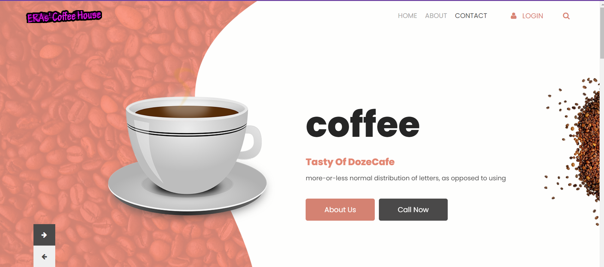

# Project: CSC-434 (DBMS Lab) - Coffee Shop Website

**Student Information:**
- **Name:** Mst Epti Ara Era
- **Email:** 22203177@iubat.edu

**Description:**
This project is a web-based application developed for the DBMS Lab (CSC-434). It consists of a Coffee Shop Website named "Eras' Coffee Shop". The website is designed to showcase various aspects of the coffee shop, including its offerings, prices, contact information, and location.

**Project Components:**
1. **HTML Files:** The main structure of the website is implemented using HTML. There are several HTML files such as `index.html`, `about.html`, `contact.html`, etc., each representing different sections of the website.

2. **CSS Files:** The styling of the website is managed using CSS files. These files define the layout, colors, fonts, and other visual aspects of the website.

3. **JavaScript Files:** JavaScript is used to add interactivity and dynamic behavior to the website. It enhances user experience by enabling features like carousel sliders, form validation, and interactive maps.

4. **Image Assets:** The `images` directory contains various image assets used throughout the website, including logos, banners, coffee images, icons, etc.

5. **Bootstrap Framework:** The website utilizes the Bootstrap framework for responsive design and pre-built components, ensuring compatibility across different devices and screen sizes.

**How to Run:**
1. Clone or download the project repository from the provided source.
2. Open the project directory in a code editor or IDE.
3. Launch the `index.html` file in a web browser to view the website locally.
4. Alternatively, host the files on a web server to make the website accessible online.

**Contributions:**
- Mst Epti Ara Era: Developed the entire project including HTML structure, CSS styling, JavaScript functionality, and content creation.

**Contact Information:**
For any inquiries or feedback regarding the project, please contact Mst Epti Ara Era at 22203177@iubat.edu.

**Note:**
This project is developed as part of the CSC-434 DBMS Lab assignment and is intended for educational purposes only. All images and content used in the website are either created by the developer or used for demonstration purposes with no commercial intent.

